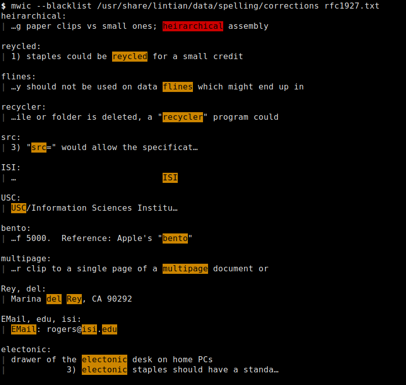

Overview
========

**mwic** is a spell-checker that groups possible misspellings and shows them in
their contexts. This is useful for checking technical documents, which often
contain words that are not included in standard dictionaries.

.. <git> (don't include in release tarballs)

Example
-------

.. </git>

Prerequisites
=============

The following software is needed to run mwic:

* Python ≥ 3.7;

* PyEnchant_, Python bindings for the Enchant_ spellchecking system;

* regex_, alternative regular expression module for Python.

Additionally, the following software is needed to rebuild the manual page from
source:

* docutils_ ≥ 0.6.

For pip users::

   python3 -m pip install pyenchant regex
   python3 -m pip install docutils

For Debian users::

   apt-get install python3-enchant python3-regex
   apt-get install python3-docutils

.. _regex:
   https://pypi.org/project/regex/
.. _pyenchant:
   https://pypi.org/project/pyenchant/
.. _Enchant:
   https://abiword.github.io/enchant/
.. _docutils:
   https://docutils.sourceforge.io/

.. vim:ts=3 sts=3 sw=3 ft=rst
